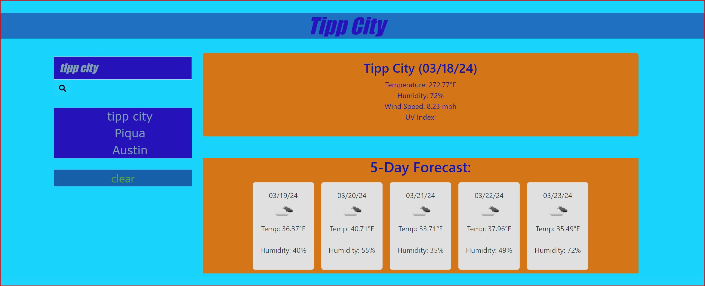

# Weather-Dashboard

## Table of Contents

 - [Description](#description)
 - [User Story](#user-story)
 - [Acceptance Criteria](#acceptance-criteria)
 - [Images](#images)
 - [Link To Deployed Webpage](#link-to-deployed-webpage)
 - [Link to GitHub Pages ](#link-to-gethub-website)
 - [Skills Used](#skills-used)

 ## Description
The main goal of this application is to use the skills we learned in class to create a weather dashboard.

 Weather Dashboard is the sixth challenge for the Ohio State coding bootcamp.
-	My motivation for this project was to become proficient at coding HTML, CSS, Javascript, and bootstrap.  
-	Building this project allowed me to implement coding techniques that I have been studying for the 6 weeks. 
-	This page was a perfect example of real-world practices and solved the problem of assignments with no starter code. 
-	I learned how to code and deploy a simle webpage with nothing more than HTML, CSS, Java Script, and bootstrap.  

 ## User Story
- AS A traveler
- I WANT to see the weather outlook for multiple cities
- SO THAT I can plan a trip accordingly

  ## Acceptance Criteria
- GIVEN a weather dashboard with form inputs
- WHEN I search for a city
- THEN I am presented with current and future conditions for that city and that city is added to the search history
- WHEN I view current weather conditions for that city
- THEN I am presented with the city name, the date, an icon representation of weather conditions, the temperature, the humidity, and the the wind speed
- WHEN I view future weather conditions for that city
- THEN I am presented with a 5-day forecast that displays the date, an icon representation of weather conditions, the temperature, the wind speed, and the humidity
- WHEN I click on a city in the search history
- THEN I am again presented with current and future conditions for that city

 ## Images

 
 ## Link to Deployed Webpage
https://harveyzr.github.io/Weather-Dashboard/
 
## Link to GitHub Website
https://github.com/harveyzr/Weather-Dashboard

 ## Skills Used
- JavaScript
- bootstrap
- jquery
- Third party API's
